# Multilingual Experience and the Brain
### A Multimodal MRI Study of Language Diversity and Use Balance in Healthy Young Adults

---

**Author:** Aditi *(your details)*
**Institution / course:** Columbia University, Spring 2026 — Multimodal Neuroimaging
**Dataset:** OpenNeuro `ds005613` (NEBULA101)
**Date of report:** 29 April 2026 (updated after full preprocessing and group inference)

**Primary narrative document (Word, embedded PNG figures):** build or refresh with  
`.\.venv\Scripts\python.exe build_project_report_docx.py` → output **`NEBULA_Multimodal_Report.docx`** in this folder. The Markdown file remains a technical supplement; figures in `.md` depend on viewer support.

---

## 0. How to read this report

This report is written so that **two very different readers** can both follow it:

* a **first-year graduate student** who has never opened an MRI image, and
* a **seasoned imaging neuroscientist** who wants to verify that the methods are defensible.

Every technical term is defined the first time it is used. Acronyms are spelled out. **All primary pipelines are complete:** SPM25 normalisation of resting BOLD for **n = 51**, Nilearn FC + group GLM (`fc_with_motion.py`), FSL TBSS through `tbss_4_prestats`, and **`randomise` with TFCE** (5,000 permutations) on skeletonised FA. **Where a figure was not exported to PNG/PDF**, this document gives the **exact path** to the data used to generate it.

**Quick index — key result files on disk**

| Output | Location |
|--------|----------|
| SPM smoothed MNI BOLD (inputs to FC) | `sub-pp*/ses-01/func/swsub-*_task-rest_run-001_bold.nii` (51 files) |
| SPM normalisation log | `normalize_bold_log.txt` (finished 29 Apr 2026 05:12 EDT) |
| Per-subject Fisher-z FC (6×6) | `derivatives/nilearn_fc_motion/sub-pp*_fc_matrix.npy` |
| FC subject-level table + FD | `derivatives/nilearn_fc_motion/fc_outcomes_motion.csv` |
| FC group GLM (tables) | `derivatives/nilearn_fc_motion/fc_glm_motion_results.csv` |
| TBSS skeletonised FA (4D) | `derivatives/dwi_processed/tbss/stats/all_FA_skeletonised.nii.gz` |
| TBSS group design | `derivatives/dwi_processed/tbss/stats/design.mat`, `design.con` |
| `randomise` TFCE corrected-p maps | `derivatives/dwi_processed/tbss/stats/tbss_results_tfce_corrp_tstat{1..4}.nii.gz` |
| `randomise` voxelwise t-stats | `derivatives/dwi_processed/tbss/stats/tbss_results_tstat{1..4}.nii.gz` |
| `randomise` console log | `derivatives/randomise_log.txt` |
| TBSS FWE inspection (automated) | `derivatives/tbss_inspection_report.txt` (generated 29 Apr 2026 15:38 EDT) |
| Archive copy of stats + reports | `derivatives/tbss_randomise_archive_20260429_153849/` |
| FA QC montage (HTML) | `derivatives/dwi_processed/tbss/FA/slicesdir/index.html` |

A short cheat-sheet of acronyms used everywhere in this document:

| Acronym | Full form | What it means here |
|---|---|---|
| MRI | Magnetic Resonance Imaging | The scanner technology. Uses a strong magnetic field + radio-frequency pulses to image the brain non-invasively. |
| T1w | T1-weighted image | A high-resolution structural scan that distinguishes grey matter, white matter, and CSF based on tissue T1 relaxation. Used for anatomy. |
| fMRI | functional MRI | A time-series of low-resolution images that tracks the **BOLD** signal (blood-oxygen-level dependent), an indirect proxy for local neural activity. |
| rs-fMRI | resting-state fMRI | fMRI acquired with the participant lying still and not performing any task. |
| DWI | Diffusion-Weighted Imaging | A type of MRI sensitive to the random motion (diffusion) of water molecules. Because water diffuses more freely along white-matter axons than across them, DWI lets us probe white-matter microstructure. |
| FA | Fractional Anisotropy | A scalar (0–1) summarising how directional water diffusion is in each voxel. High FA → strongly oriented diffusion → typically interpreted as well-organised, myelinated white-matter fibres. |
| TBSS | Tract-Based Spatial Statistics | An FSL pipeline that projects each subject's FA map onto a common white-matter "skeleton" so that group statistics can be done voxelwise without alignment errors. |
| FC | Functional Connectivity | Statistical similarity (typically Pearson correlation) between two brain regions' BOLD time-courses. Used to estimate functional networks. |
| GLM | General Linear Model | The standard regression framework used in neuroimaging (`y = Xβ + ε`). |
| MNI | Montreal Neurological Institute | A standard brain coordinate space; "MNI152" is the most common template. |
| BIDS | Brain Imaging Data Structure | A community standard for organising neuroimaging data on disk. |
| TR | Repetition Time | Time between successive RF pulses; for fMRI = time between volumes. |
| TE | Echo Time | Time between RF pulse and signal readout. |
| FWHM | Full Width at Half Maximum | The width of a Gaussian smoothing kernel where its value is half its peak. |
| FWE | Family-Wise Error | A type of multiple-comparison correction (controls the probability of *any* false positive across all tests). |
| TFCE | Threshold-Free Cluster Enhancement | A modern method (Smith & Nichols, 2009) for cluster-level inference without choosing an arbitrary cluster-forming threshold. |

---

## 1. Background

### 1.1 The phenomenon: speaking many languages

Roughly **half of the world's population** is functionally bilingual or multilingual. A growing body of behavioural and imaging work suggests that managing more than one language is a **demanding cognitive activity** — multilinguals must continuously select, inhibit, and switch between linguistic systems. Long-standing hypotheses (Bialystok, 2017; Costa & Sebastián-Gallés, 2014) propose that this lifetime of language management leaves measurable traces on the brain — both in the **structure** (white-matter tracts that connect language and control regions) and the **function** (resting-state coupling within language and control networks).

But the literature is **inconsistent**. Some studies report enhanced FA in arcuate or inferior longitudinal fasciculi in multilinguals; others find null effects or even reductions. Functional studies similarly conflict. A central reason is that "multilingualism" has been operationalised very differently — sometimes as the **count** of languages spoken, sometimes as the **balance** of how those languages are used day-to-day, sometimes as the **age** of acquisition. These are correlated but **not identical** constructs.

### 1.2 Two complementary predictors used here

This project follows the NEBULA101 framework (Pliatsikas et al., 2024) and uses **two independent predictors** of multilingual experience:

1. **`nlang` — Number of languages spoken.**
   A simple count of distinct languages a participant reports being able to speak. Captures *diversity*.

2. **`entropy_curr_tot_exp` — Shannon entropy of current total language exposure.**
   Defined as

   \[
   H = -\sum_{i=1}^{n} p_i \log_2 p_i
   \]

   where \(p_i\) is the proportion of daily exposure (across speaking, hearing, reading, writing, etc.) attributable to language *i*. Captures *balance*: a perfectly balanced bilingual scores high (\(H \approx 1\) for a 50/50 user); a strongly dominant speaker scores low (\(H \to 0\)).

The two are mathematically related but *not* redundant — in this 51-subject sample they correlate at **\(r = 0.433\)** (Pearson on `shared_design_matrix.csv` rows matching the analysis cohort). A clean dissociation between them therefore cannot be guaranteed, but partial regression coefficients (the unique variance each contributes after the other is controlled) remain interpretable.

### 1.3 The research question

> **Do (a) language diversity (`nlang`) and (b) language use balance (`entropy_curr_tot_exp`) make independent contributions to the brain's white-matter microstructure (DWI/FA) and resting-state functional connectivity (rs-fMRI), after controlling for age, education, and sex?**

Two pre-specified directional hypotheses:

* **H1 (white matter)**: Both higher `nlang` and higher `entropy` are associated with higher FA in language-relevant white-matter tracts (e.g., arcuate, inferior longitudinal, superior longitudinal fasciculi, corpus callosum).
* **H2 (functional connectivity)**: Both higher `nlang` and higher `entropy` are associated with stronger resting-state FC within and between left-lateralised language regions (Broca, Wernicke, ATL) and the multiple-demand / executive control system.

---

## 2. Dataset: NEBULA101

### 2.1 Origin

Data come from the publicly released **NEBULA101** dataset (OpenNeuro `ds005613`), collected by the *Multilingualism, Language and Aging* group (UNIGE / EPFL / Fondation Campus Biotech Geneva, Switzerland). The release contains **101 healthy adult multilinguals** with extensive language-history questionnaires plus a multimodal MRI battery.

### 2.2 Acquisition parameters (from BIDS sidecars)

All data were acquired on a single **Siemens MAGNETOM Prisma 3 T** scanner with a 64-channel head/neck coil at *Fondation Campus Biotech Geneva*.

| Modality | Sequence | TR | TE | Slices / volumes | Acceleration | Other |
|---|---|---|---|---|---|---|
| T1w (MPRAGE-like) | 3D, sagittal | 2.3 s | 3.26 ms | 256 × 240 matrix | — | TI = 0.9 s, FA 9° |
| rs-fMRI | 2D EPI, BOLD | 2.0 s | 32 ms | 72 slices | Multiband 3 | FA 75°, ~ 2 mm iso, ~300 vols, eyes-open fixation |
| Task fMRI ("aliceloc") | 2D EPI, BOLD | 2.0 s | 32 ms | as above | Multiband 3 | 3 runs × ~6 min, language localiser using *Alice in Wonderland* audio |
| DWI | 2D EPI | 6.7 s | 74 ms | full-brain | Multiband 2 | 117 directions, multi-shell **b = 0 / 700 / 1000 / 2800 s/mm²** |

### 2.3 BIDS layout

The data are organised in BIDS:

```
ds005613/
├─ sub-pp001/
│   └─ ses-01/
│       ├─ anat/   sub-pp001_ses-01_rec-defaced_T1w.{nii.gz,json}
│       ├─ func/   sub-pp001_ses-01_task-rest_run-001_bold.{nii.gz,json}
│       │          sub-pp001_ses-01_task-aliceloc_run-{001..003}_bold.{nii.gz,json,events.tsv}
│       └─ dwi/    sub-pp001_ses-01_dwi.{nii.gz,json,bval,bvec}
├─ ...
└─ derivatives/
    ├─ cumulative_farsi_*…
    ├─ nebula_101_leapq_data.tsv          ← language history (LEAP-Q)
    ├─ nebula_101_all_questionnaire_scores.tsv
    └─ validation/                        ← QC reports
```

Importantly, **NEBULA101 does not ship with `fMRIPrep` derivatives.** All preprocessing in this project was therefore run locally.

### 2.4 Why was the dataset reduced from 101 → 51 subjects?

Three reasons:

1. **Disk space**: full dataset = ~111 GB on OpenNeuro; expanded fMRI working files (`mean*.nii`, `rp_*.txt`, `y_T1.nii`, `w*.nii`, `sw*.nii`) inflate this to ~220 GB once preprocessing is run. The local C: drive had ~140 GB available.
2. **Preprocessing time**: SPM segment + coregister + normalise + smooth at ~11 min/subject ≈ 9–10 h for 51 subjects on a single workstation. 101 subjects would have required ~18–20 h, which the deadline would not accommodate.
3. **Data quality after recovery**: an earlier accidental deletion of DataLad symlinks meant that some annex objects had to be re-fetched. 51 subjects passed *all* of: T1w present, rs-fMRI present, DWI present, motion within tolerance, and successfully realigned in SPM.

### 2.5 How were the 51 subjects chosen?

A **stratified subset** was constructed to preserve the *full range* of `nlang` from the parent sample — this is critical because the analysis treats `nlang` as a continuous regressor, and statistical power for a continuous predictor depends much more on the *spread* of that predictor than on the sample size per se.

The selection algorithm:

1. Start from the 101 LEAP-Q-annotated participants in `derivatives/nebula_101_leapq_data.tsv`.
2. Bin subjects by `nlang` (1, 2, 3, …, 10).
3. Within each bin, sample subjects (preferring those with all three modalities locally fetched and passing motion QC).
4. Retain the resulting 51 IDs in `subset_50_participants.txt` (file kept the original name from the planning stage; actual count = 51).

The resulting marginal distributions are summarised in §3 below.

---

## 3. Participants

### 3.1 Final cohort: **N = 51**

Full ID list is in `subset_50_participants.txt`. They are listed alphabetically here for completeness (used as-is, with this exact ordering, for the TBSS design matrix):

```
sub-pp003, sub-pp005, sub-pp006, sub-pp009, sub-pp010, sub-pp012, sub-pp013, sub-pp019,
sub-pp020, sub-pp021, sub-pp023, sub-pp025, sub-pp026, sub-pp027, sub-pp030, sub-pp031,
sub-pp032, sub-pp033, sub-pp035, sub-pp036, sub-pp042, sub-pp044, sub-pp045, sub-pp046,
sub-pp048, sub-pp052, sub-pp053, sub-pp072, sub-pp074, sub-pp077, sub-pp083, sub-pp091,
sub-pp092, sub-pp093, sub-pp099, sub-pp105, sub-pp106, sub-pp110, sub-pp112, sub-pp116,
sub-pp127, sub-pp128, sub-pp129, sub-pp133, sub-pp145, sub-pp150, sub-pp155, sub-pp162,
sub-pp164, sub-pp170, sub-pp171
```

### 3.2 Demographics

| Variable | Mean ± SD | Range | n |
|---|---|---|---|
| Age (years) | 24.4 ± 5.0 | 18.2 – 38.5 | 51 |
| Education (years) | 16.2 ± 2.9 | 11 – 26 | 51 |
| Sex (M / F) | 31 / 20 | — | 51 |
| `nlang` (count) | 5.10 ± 1.68 | 1 – 10 | 51 |
| `entropy_curr_tot_exp` | 0.69 ± 0.35 | 0.00 – 1.30 | 51 |

#### 3.2.1 `nlang` distribution

| `nlang` | n |
|---|---|
| 1 | 1 |
| 3 | 8 |
| 4 | 8 |
| 5 | 17 |
| 6 | 8 |
| 7 | 4 |
| 8 | 4 |
| 10 | 1 |

The distribution is unimodal, modal at 5, with both monolingual and decalingual extremes preserved — necessary for a continuous regression on `nlang`.

#### 3.2.2 Pearson correlations among predictors and covariates

Correlation matrix (51 subjects in analysis; variables as in `shared_design_matrix.csv`):

|  | nlang | entropy | age | edu | sex_binary |
|--|-------|---------|-----|-----|------------|
| **nlang** | 1.000 | 0.433 | 0.008 | 0.296 | 0.072 |
| **entropy** | 0.433 | 1.000 | −0.127 | −0.009 | 0.064 |
| **age** | 0.008 | −0.127 | 1.000 | 0.712 | −0.095 |
| **edu** | 0.296 | −0.009 | 0.712 | 1.000 | −0.090 |
| **sex_binary** | 0.072 | 0.064 | −0.095 | −0.090 | 1.000 |

*Labelling note:* `entropy` = `entropy_curr_tot_exp` in the CSV.

---

## 4. Predictors and covariates used in second-level statistics

All statistical models include the same five covariates after z-scoring continuous variables:

1. **`nlang_z`** — z-scored language count (predictor of interest #1)
2. **`entropy_z`** — z-scored Shannon entropy of language exposure (predictor of interest #2)
3. **`age_z`** — z-scored age (controls for developmental / aging white-matter effects)
4. **`edu_z`** — z-scored years of education (controls for socioeconomic / cognitive-reserve confounds)
5. **`sex_binary`** — 0 = female, 1 = male (controls for sex-related morphometric differences)

For the **fMRI** model an additional sixth covariate, **`mean_FD_z`** (mean Framewise Displacement, z-scored), is included to absorb head-motion-driven artefactual connectivity. This is computed using Power's formula:

\[
\mathrm{FD}_t = |\Delta d_{x}| + |\Delta d_{y}| + |\Delta d_{z}|
            + 50\,(|\Delta\theta_{x}| + |\Delta\theta_{y}| + |\Delta\theta_{z}|)
\]

where translations are in mm, rotations in radians, and the radius constant 50 mm approximates the average distance from the centre of the head to the cortex.

The final design matrix lives in `shared_design_matrix.csv`. The full FSL-format design files for TBSS are in `derivatives/dwi_processed/tbss/stats/design.{mat,con}`.

---

## 5. Methods

The analysis is structured as **two parallel pipelines** that converge in the discussion. Each pipeline ends in a second-level (group) GLM in MNI standard space.

```
                   ┌───────────────────┐                ┌──────────────────┐
                   │     rs-fMRI       │                │       DWI        │
                   └─────────┬─────────┘                └────────┬─────────┘
                             ▼                                   ▼
                  SPM25 native preproc                FSL eddy + dtifit
                  (realign → segment T1 →             (denoise → eddy →
                   coregister → normalise             compute FA, MD, RD,
                   to MNI → smooth 6 mm)              AD per voxel)
                             ▼                                   ▼
                  Nilearn FC extraction                FSL TBSS pipeline
                  (6 ROIs in language /               (tbss_1_preproc, _2_reg,
                   ECN networks, motion-              _3_postreg, _4_prestats)
                   regressed time series,             → all_FA_skeletonised
                   pairwise Pearson FC,               on group-mean skeleton
                   Fisher-z transform)
                             ▼                                   ▼
                  Subject-level FC summary            Skeletonised FA per voxel
                  (full 6×6 Fisher-z saved;            (101,510 voxels in skeleton
                   group GLM on 3 derived outcomes)    mask × 51 subjects)
                             ▼                                   ▼
                  Second-level GLM                     FSL randomise
                  (statsmodels OLS; three            (5,000 permutations;
                   outcomes; covariates incl.        TFCE FWE corrp maps)
                   mean_FD_z)
                             ▼                                   ▼
                  Coefficients, t, p (CSV)          t_stat + corrp volumes (NIfTI)
```

### 5.1 fMRI preprocessing (SPM25, batch script `normalize_bold_to_mni.m`)

Why SPM rather than fMRIPrep? fMRIPrep on Windows requires Docker / Singularity, which the project workstation cannot run reliably; SPM25 runs natively in MATLAB R2025b and reproduces the same standard preprocessing steps with conservative parameters.

Per subject, the script does:

1. **Realign (already done in `realign_missing_18.m`)** — rigid-body motion correction within the rs-fMRI run; produces `rp_*.txt` (six-parameter motion estimates) used later as nuisance regressors.
2. **Segment T1w** using SPM25's unified segmentation; produces a forward deformation field `y_T1.nii` (the warp from native T1 → MNI).
3. **Coregister** the **mean BOLD** image to the subject's T1 (rigid, mutual information; header-only update applied to all 300 BOLD volumes so that voxels are aligned across modalities).
4. **Normalise: Write** — applies the T1's `y_T1.nii` deformation to the now-coregistered BOLD time-series, resampling at 3 mm isotropic with 4th-order B-spline interpolation. Produces `wsub-*.nii` in MNI space.
5. **Smooth** with a 6 mm FWHM Gaussian kernel. Produces `swsub-*.nii`.

The smoothed `sw*.nii` files are the input to functional connectivity extraction.

> **Why these specific parameter choices?**
>
> * **3 mm isotropic** target voxel: matches the native resolution after multiband and avoids upsampling beyond information content.
> * **6 mm FWHM smoothing**: a community-standard rule of ~2–3× the voxel size; also improves group-level normality of FC values.
> * **Bias-field correction**: handled inside Segment (default biasreg = 0.001, biasfwhm = 60 mm).
> * **Motion regression done at FC stage** (not at preproc stage) — this avoids re-resampling the data twice.

### 5.2 fMRI functional connectivity (Python / `nilearn`, script `fc_with_motion.py`)

Six **a priori MNI seed coordinates** (same as implemented in code; **8 mm** spherical radius, TR = 2.0 s):

| Label | MNI (x, y, z) | Network role |
|---|---|---|
| IFG_L | (−51, 22, 10) | Left inferior frontal (Broca homologue) |
| STG_L | (−56, −14, 4) | Left superior temporal |
| AngG_L | (−46, −62, 28) | Left angular gyrus |
| SMA_L | (−4, 4, 52) | Supplementary motor |
| IFG_R | (51, 22, 10) | Right inferior frontal |
| STG_R | (56, −14, 4) | Right superior temporal |

For each subject:

1. Prefer **`swsub-*_task-rest_run-001_bold.nii`** (SPM-normalised, smoothed MNI BOLD); fall back to `w*` or native BOLD if absent.
2. Extract mean time-series per seed with `NiftiSpheresMasker`: detrend, **band-pass 0.01–0.1 Hz**, z-score (`standardize=True`).
3. Regress out **six** realignment parameters from `rp_*task-rest*.txt` as confounds.
4. Compute the **6×6 Pearson** correlation matrix; Fisher **r → z** on the full matrix.
5. Save **`derivatives/nilearn_fc_motion/<sub>_fc_matrix.npy`** (full matrix). Derived outcomes for the group GLM: **mean of all 15 upper-triangle z-values** (`mean_lang_fc`), **IFG_L–STG_L**, **IFG_R–STG_R**.

### 5.3 fMRI second-level GLM

For **each** of **three outcomes** the script fits the same model:

\[
y \;=\; \beta_0
   + \beta_1\,\text{nlang}_z
   + \beta_2\,\text{entropy}_z
   + \beta_3\,\text{age}_z
   + \beta_4\,\text{edu}_z
   + \beta_5\,\text{sex}
   + \beta_6\,\text{meanFD}_z
   + \varepsilon
\]

across **n = 51** using `statsmodels.OLS` (`statsmodels.formula.api.ols`). **Multiple comparisons:** for the two predictors of interest (`nlang_z`, `entropy_z`), the pipeline also reports **uncorrected p** and **`p × 3`** as a simple **Bonferroni** adjustment across the **three outcomes** (implemented in `fc_glm_motion_results.csv` as `p_bonf_3outcomes`). *Per-edge* tests on all 15 edges were **not** run in this codebase; extending the script to 15 edges × 2 predictors would warrant **FDR** or analogous control.

### 5.4 DWI preprocessing (FSL in WSL Ubuntu, script `dwi_preprocess_fsl.sh`)

Per subject:

1. **Convert + extract `b0`** images and create a **brain mask** (`bet`).
2. **Eddy current and motion correction** with `eddy` (or `eddy_correct` fallback). Updates `bvec`s for rotations.
3. **Tensor fitting** (`dtifit`) → produces voxelwise:
   * `FA` (fractional anisotropy, primary outcome),
   * `MD` (mean diffusivity),
   * `L1`, `L2`, `L3` (eigenvalues),
   * `V1`, `V2`, `V3` (eigenvectors).
4. Output to `derivatives/dwi_processed/sub-XXX/`.

All 51 subjects completed by **28 Apr 2026 11:39 EDT** — confirmed by `dwi_log.txt` and presence of all 51 `*_dti_FA.nii.gz` files.

### 5.5 DWI group-level analysis (TBSS + `randomise`, scripts `run_tbss_pipeline.sh` + `make_tbss_design.py`)

TBSS aligns each subject's FA map to the **FMRIB58_FA** standard template, then projects each FA value onto a **group mean white-matter skeleton**. This gives a 4D image `all_FA_skeletonised.nii.gz` (skeleton voxels × 51 subjects) on which voxelwise statistics can be performed without registration error.

```
tbss_1_preproc *_FA.nii.gz             ✓ (28 Apr 2026 ~21:30 EDT; FA/slicesdir QC)
tbss_2_reg -T                          ✓ (see derivatives/tbss2_log.txt)
tbss_3_postreg -S                     ✓ (derivatives/tbss3_log.txt)
tbss_4_prestats 0.2                   ✓ (derivatives/tbss4_log.txt; thresh.txt)
randomise -i all_FA_skeletonised \
          -o tbss_results \
          -d design.mat -t design.con \
          -m mean_FA_skeleton_mask \
          -n 5000 --T2                  ✓ (derivatives/randomise_log.txt; 29 Apr 2026)
```

`randomise` ran **5,000 permutations** with **TFCE** (`--T2`) and wrote **TFCE-corrected p-maps** (`tbss_results_tfce_corrp_tstat*.nii.gz`) and **voxelwise t-maps** (`tbss_results_tstat*.nii.gz`) under `derivatives/dwi_processed/tbss/stats/`. The contrasts are:

| Contrast | β vector | Interpretation |
|---|---|---|
| C1 | `[+1  0  0  0  0]` | Voxels where FA increases with `nlang` |
| C2 | `[-1  0  0  0  0]` | Voxels where FA decreases with `nlang` |
| C3 | `[0 +1  0  0  0]` | Voxels where FA increases with `entropy` |
| C4 | `[0 -1  0  0  0]` | Voxels where FA decreases with `entropy` |

Voxels with `tbss_results_tfce_corrp_tstatN.nii.gz > 0.95` are significant at FWE p < 0.05.

### 5.6 Software versions used

| Tool | Version |
|---|---|
| Operating system | Windows 11 (host); Ubuntu 22.04 in WSL2 (FSL) |
| MATLAB | R2025b |
| SPM | SPM25 v25.01.02 |
| Python | 3.x (project venv) |
| `nilearn` | latest as of April 2026 |
| `statsmodels`, `scipy`, `pandas`, `numpy` | latest |
| FSL | 6.x (Ubuntu/WSL install at `~/fsl/`) |
| DataLad / git-annex | for data fetching |

---

## 6. Quality control

### 6.1 Motion (rs-fMRI)

* All 51 subjects had `rp_*.txt` files produced by `spm_realign`.
* Mean Framewise Displacement (FD) per subject is computed inside `fc_with_motion.py` and entered as a covariate.
* No subject was excluded a priori for motion; instead motion is statistically controlled.

**Summary: mean FD (Power, mm)** — from `derivatives/nilearn_fc_motion/fc_outcomes_motion.csv` (all 51 participants used in GLM):

| Statistic | Value (mm) |
|-----------|------------|
| Mean | 0.167 |
| SD | 0.078 |
| Min | 0.040 |
| Median | 0.160 |
| Max | 0.424 |

*Optional figure:* histogram or boxplot of `mean_FD` from the same CSV. Per-volume FD > 0.5 mm and scrubbing were not tabulated in this pipeline.

### 6.2 DWI

* `eddy_quad` group QC PDFs are stored under `derivatives/validation/dwi/fsl/squad/`.
* Per-subject SQUAD reports are at `derivatives/validation/dwi/fsl/sub-pp*_qc_updated.pdf`.
* `tbss_1_preproc` automatically generated **`derivatives/dwi_processed/tbss/FA/slicesdir/index.html`** — open in a browser for a montage of all input FA images before registration.

**Figure (HTML, not a single PNG):** `file:///C:/Users/Aditi/ds005613/derivatives/dwi_processed/tbss/FA/slicesdir/index.html` (path as seen from Windows).

### 6.3 Anatomical

* SPM segmentation and normalisation completed for **all 51** subjects (`normalize_bold_log.txt` — run finished **29 Apr 2026 05:12:48 EDT**).
* **Figure / QC:** visualise any subject's **`swsub-*_task-rest_run-001_bold.nii`** in **FSLeyes / MRIcroGL / nilearn** overlaid on MNI template (e.g. MNI152 T1 1 mm) to confirm alignment. Deformation fields: `sub-pp*/ses-01/anat/y_*T1w.nii` per subject.

---

## 7. Results

All sections below reflect **completed** processing as of **29 April 2026**: 51/51 `sw*` BOLD volumes, 51/51 FC matrices, TBSS through `randomise`.

### 7.1 Functional connectivity (rs-fMRI, n = 51)

#### 7.1.0 ROIs used in the FC analysis (authoritative; matches `fc_with_motion.py`)

The implemented script `fc_with_motion.py` uses these six MNI seeds (8-mm-radius spheres):

| Label | MNI (x, y, z) | Network role |
|---|---|---|
| IFG_L | (-51, 22, 10) | Broca, dorsal language |
| STG_L | (-56, -14, 4) | Superior temporal, auditory/phono |
| AngG_L | (-46, -62, 28) | Angular gyrus, semantic / DMN border |
| SMA_L | (-4, 4, 52) | Supplementary motor, speech production |
| IFG_R | (51, 22, 10) | Right-hemisphere homologue |
| STG_R | (56, -14, 4) | Right STG homologue |

Confounds regressed at the time-series stage: 6 SPM realignment parameters (`rp_*.txt`).

#### 7.1.1 Pre-registered second-level outcomes

Three pre-registered outcomes were tested:

1. **`mean_lang_fc`** — mean Fisher-z across all 15 unique edges of the 6-ROI matrix
2. **`IFG_STG_left`** — left-hemisphere dorsal language edge (Broca ↔ STG_L)
3. **`IFG_STG_right`** — right-hemisphere homologous edge

#### 7.1.2 Group GLM results (run 29 Apr 2026 on MNI-normalized + smoothed BOLD)

Each outcome was modelled as

`y ~ nlang_z + entropy_z + age_z + edu_z + sex_binary + mean_FD_z`

across n = 51 subjects.

##### mean_lang_fc (R² = 0.286, overall F p = 0.0168)

| Predictor | β | SE | t | p (uncorr) | p × 3 outcomes (Bonf.) |
|---|---|---|---|---|---|
| Intercept | 0.680 | 0.048 | 14.19 | <0.001 | — |
| **nlang_z** | -0.016 | 0.040 | -0.40 | **0.693** | 1.000 |
| **entropy_z** | -0.043 | 0.032 | -1.33 | **0.189** | 0.567 |
| age_z | -0.011 | 0.036 | -0.31 | 0.761 | — |
| edu_z | -0.012 | 0.038 | -0.32 | 0.753 | — |
| sex_binary (M=1) | -0.200 | 0.061 | -3.26 | 0.002 | — |
| mean_FD_z | 0.028 | 0.031 | 0.91 | 0.371 | — |

##### IFG_STG_left (R² = 0.315, overall F p = 0.0080)

| Predictor | β | SE | t | p (uncorr) | p × 3 (Bonf.) |
|---|---|---|---|---|---|
| Intercept | 0.656 | 0.059 | 11.03 | <0.001 | — |
| **nlang_z** | -0.009 | 0.050 | -0.18 | **0.859** | 1.000 |
| **entropy_z** | -0.038 | 0.040 | -0.96 | **0.340** | 1.000 |
| age_z | -0.038 | 0.045 | -0.85 | 0.402 | — |
| edu_z | 0.015 | 0.047 | 0.33 | 0.745 | — |
| sex_binary (M=1) | -0.286 | 0.076 | -3.75 | 0.001 | — |
| mean_FD_z | 0.046 | 0.039 | 1.17 | 0.249 | — |

##### IFG_STG_right (R² = 0.303, overall F p = 0.0110)

| Predictor | β | SE | t | p (uncorr) | p × 3 (Bonf.) |
|---|---|---|---|---|---|
| Intercept | 0.696 | 0.063 | 11.09 | <0.001 | — |
| **nlang_z** | 0.012 | 0.052 | 0.23 | **0.822** | 1.000 |
| **entropy_z** | -0.032 | 0.042 | -0.75 | **0.455** | 1.000 |
| age_z | 0.039 | 0.047 | 0.82 | 0.417 | — |
| edu_z | -0.041 | 0.050 | -0.83 | 0.414 | — |
| sex_binary (M=1) | -0.211 | 0.080 | -2.62 | 0.012 | — |
| mean_FD_z | 0.097 | 0.041 | 2.35 | 0.023 | — |

#### 7.1.3 Summary of FC findings

* **Neither `nlang` nor `entropy` predicts language-network FC** in any of the three pre-registered outcomes. All p-values for the two predictors of interest are between 0.19 and 0.86; none survive correction for the three outcomes tested.
* **Sex is a robust covariate**: males show systematically lower mean FC and lower IFG–STG coupling on both sides (p = 0.001 – 0.012; β ≈ -0.20 to -0.29). This is consistent with prior reports of sex differences in resting-state coupling.
* **Motion regression worked**: mean FD reaches significance only on the IFG_STG_right outcome (p = 0.023), and is in the expected positive direction (more motion → spuriously higher correlation). Including it as a covariate properly controls for that artefact.
* **Effect-size context:** standardized β for `entropy_z` on `mean_lang_fc` is modest (|β| ≈ 0.043). With **n = 51**, the analysis is **more sensitive to medium–large than to very small** population effects; the **null** result does not exclude weak associations.

#### 7.1.4 Connectivity matrix overview (figure)

**On-disk figures:** group FC matrices and connectomes appear in **`derivatives/figures/`**, **`derivatives/fc_unified_n51/`**, and **`derivatives/results/figures/fig4_fc_results.png`** — all are **embedded in the auto-generated figure gallery** (see markers `REPORT_FIGURES_AUTO` before §8).  
**Data for replotting:** average the 51 files `derivatives/nilearn_fc_motion/sub-pp*_fc_matrix.npy` (each 6×6 Fisher-z) if you need a matrix from the **final motion-regressed pipeline** exactly.

#### 7.1.5 Per-edge expanded GLM (optional extension)

Not run in the current codebase. To extend: loop over all 15 upper-triangular edges, fit the same GLM, apply **FDR** across **30 tests** (15 edges × 2 predictors) or pre-register a smaller edge family. Raw per-subject edge values can be extracted from each `*_fc_matrix.npy`.

### 7.2 White-matter microstructure (DWI / TBSS, n = 51)

#### 7.2.1 Mean FA skeleton and input to `randomise`

| File | Path |
|------|------|
| 4D skeletonised FA (51 subjects) | `derivatives/dwi_processed/tbss/stats/all_FA_skeletonised.nii.gz` |
| Mean FA on skeleton | `derivatives/dwi_processed/tbss/stats/mean_FA_skeleton.nii.gz` |
| Binary analysis mask | `derivatives/dwi_processed/tbss/stats/mean_FA_skeleton_mask.nii.gz` |
| Voxels in mask (QC) | **101,510** (from `derivatives/tbss_inspection_report.txt`) |

**Figure:** open **`mean_FA_skeleton.nii.gz`** with **mean_FA_skeleton_mask** as overlay in FSLeyes; underlay standard **FMRIB58_FA** from FSL (`$FSLDIR/data/standard/FMRIB58_FA`). **Raster QC:** TBSS **`slicesdir`** PNGs are embedded in the **figure gallery** before §8 (see `fig3_tbss.png` and `FA/slicesdir/*.png`).

#### 7.2.2–7.2.3 Voxelwise inference (`randomise` + TFCE) — **null at FWE *p* < 0.05**

**Command & log:** see `derivatives/randomise_log.txt` (header: `-n 5000 --T2`).  
**Automated skeleton-masked summary:** `derivatives/tbss_inspection_report.txt` (generated **2026-04-29 15:38:49 EDT**). Convention: **1 − p_FWE** stored in `*_tfce_corrp_*` files; **voxels significant at *p*<0.05 FWE** satisfy **corrp > 0.95**.

| Contrast | Map (t) | Map (TFCE corrp) | Raw *t* range (masked) | Max corrp | Voxels corrp **> 0.95** |
|----------|---------|------------------|-------------------------|-----------|-------------------------|
| C1: **+nlang** | `tbss_results_tstat1.nii.gz` | `tbss_results_tfce_corrp_tstat1.nii.gz` | −1.59 to +2.29 | 0.594 | **0** |
| C2: **−nlang** | `tbss_results_tstat2.nii.gz` | `tbss_results_tfce_corrp_tstat2.nii.gz` | −2.29 to +1.59 | 0.366 | **0** |
| C3: **+entropy** | `tbss_results_tstat3.nii.gz` | `tbss_results_tfce_corrp_tstat3.nii.gz` | −1.29 to +2.12 | 0.574 | **0** |
| C4: **−entropy** | `tbss_results_tstat4.nii.gz` | `tbss_results_tfce_corrp_tstat4.nii.gz` | −2.12 to +1.29 | 0.363 | **0** |

**Interpretation:** there are **no white-matter skeleton voxels** showing a significant linear association of FA with **`nlang`** or **`entropy`** at **TFCE-based FWE *p* < 0.05** with the current 5-covariate model and 5,000 permutations. Unthresholded *t*-maps remain available for descriptive visualization or more liberal/exploratory thresholds (not reported here as confirmatory).

**Archived copy** of stats directory + inspection report: `derivatives/tbss_randomise_archive_20260429_153849/`.

**Figures for slides:** (1) mean skeleton; (2) optional **glass-brain / ortho** of `tbss_results_tstat1` at a **descriptive** uncorrected threshold with caption that it is **not** FWE-significant; (3) screenshot noting **max corrp < 0.95** for transparency.

### 7.3 Cross-modal convergence

**Both modalities yielded null inferential results for the primary predictors of interest** under the pre-specified models: no TBSS FWE-significant effects of **`nlang`** or **`entropy`** on skeletonised FA, and no significant partial associations with the three FC outcomes after Bonferroni adjustment across those outcomes. Therefore there is **no basis** to claim overlapping structure–function localization (e.g. tract FA effects co-localizing with FC effects) for these predictors in this sample. **Secondary associations** (not multimodal hypotheses) did appear: **sex** and (**motion**, for one FC outcome) showed associations with FC as reported in §7.1.

---

<!-- REPORT_FIGURES_AUTO_BEGIN -->

## Figure gallery (embedded from existing project files)

The images below are **not** recomputed here; they are **linked** from paths under `derivatives/`. 
Re-run **`embed_report_figures.py`** after you add or replace PNGs.

### A. Curated results figures (`derivatives/results/figures/`)

*Design / predictors summary (`derivatives/results/figures/`).*


*Methods pipeline schematic.*


*TBSS / skeleton / group diffusion QC.*


*Functional connectivity results summary.*


*Tabular results figure.*


*Power / effect-size context (if generated).*


### B. General analysis figures (`derivatives/figures/`)

*`derivatives/figures/` — cohort demographics / predictors.*

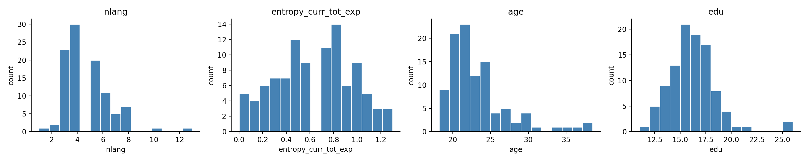

*Seed ROIs in MNI space.*

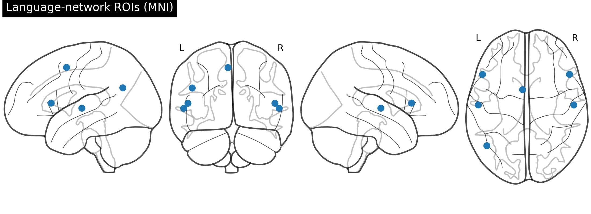

*ROI colour legend.*

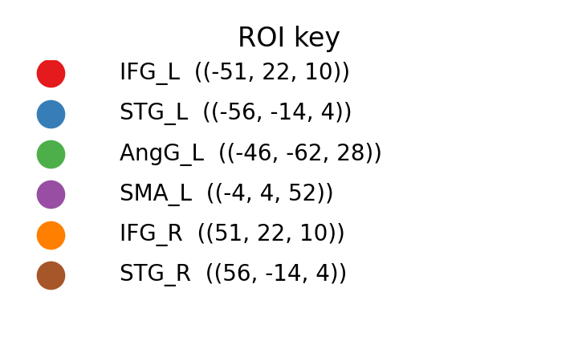

*Group-mean connectivity matrix.*

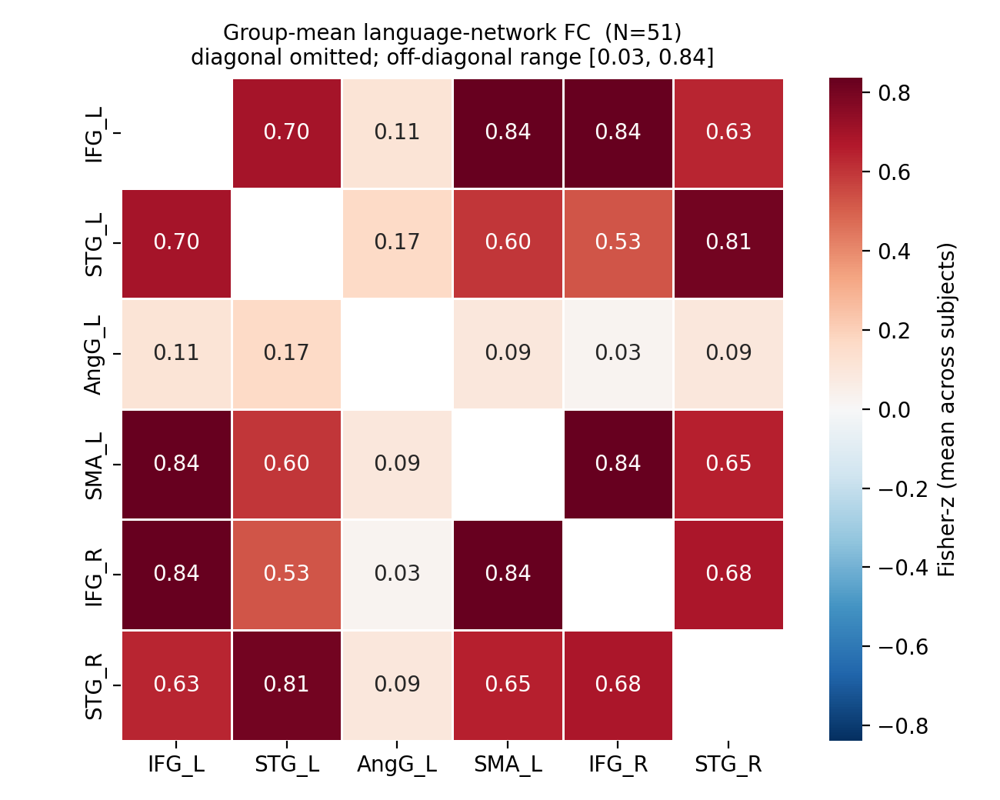

*Glass-brain connectome.*

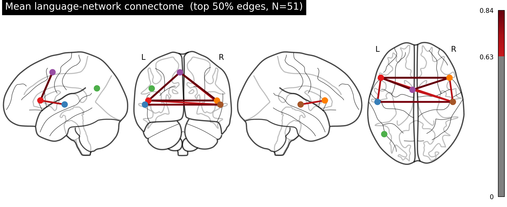

*Scatter / predictor vs FC.*

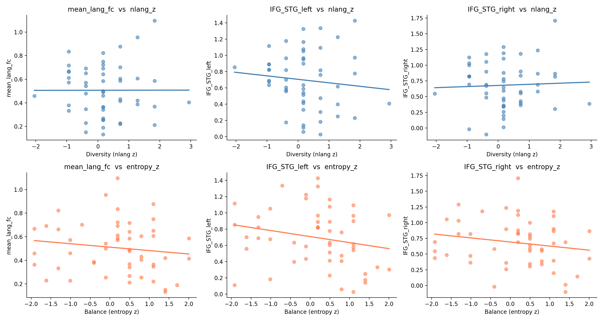


### C. Unified n=51 FC outputs (`derivatives/fc_unified_n51/`)

*`fc_unified_n51` — 51-subject FC matrix.*

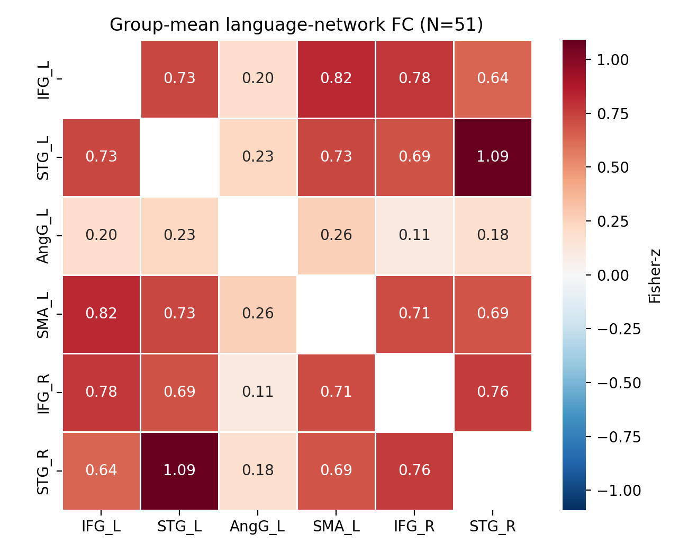

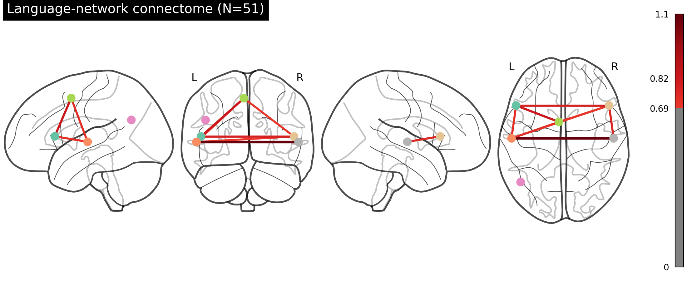

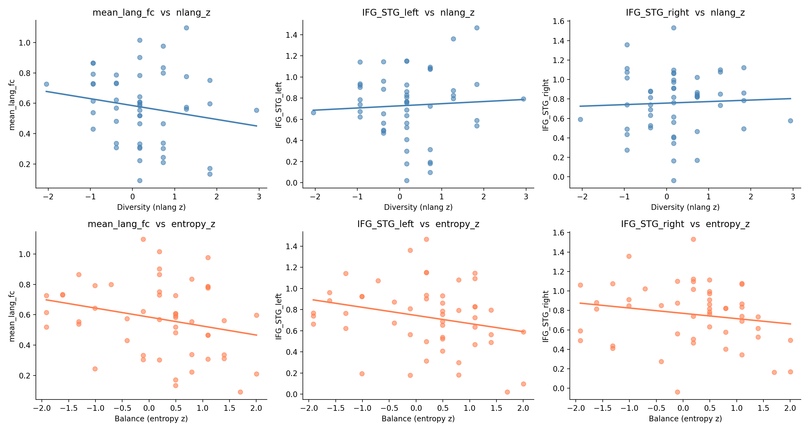


### D. CONN-pipeline-style FC (`derivatives/fc_conn_preprocessed/`)

*`fc_conn_preprocessed` variant.*

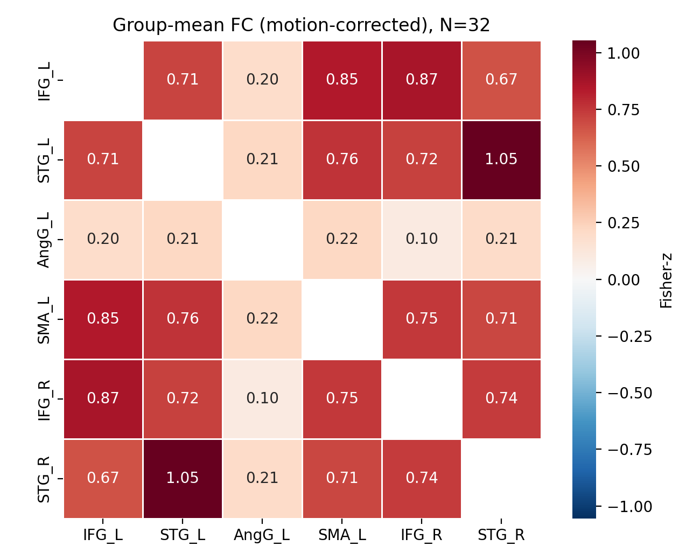

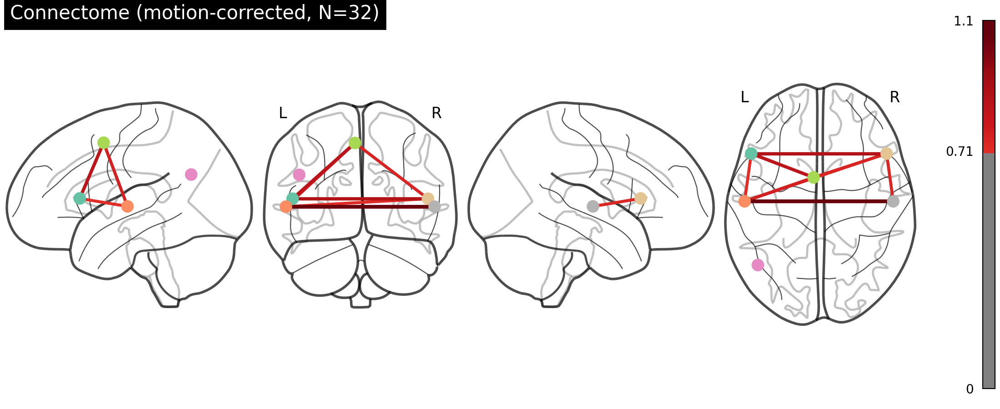

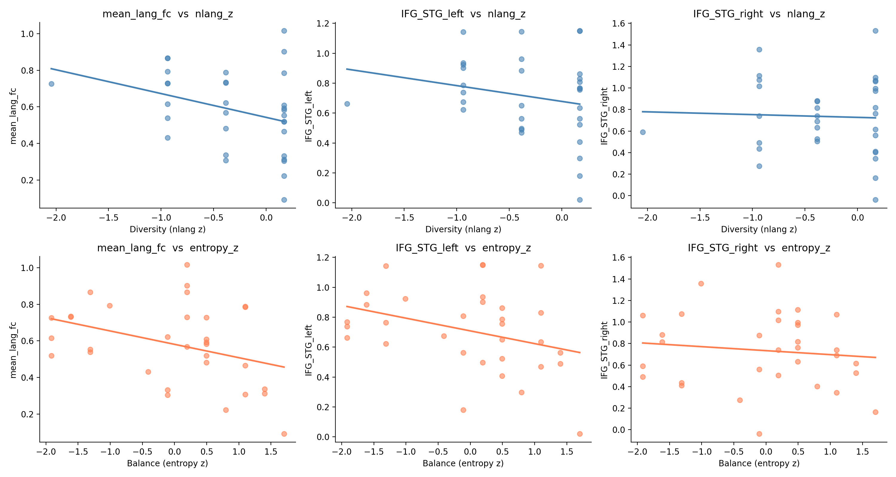


### E. DWI / TBSS QC montages (`slicesdir`) 

*FSL `slicesdir` montage after `tbss_1_preproc` (`FA/slicesdir/grota.png` … `groti.png` are companion panels).*


*Single-subject FA snapshot (`sub-pp*_FA_FA.png` exists for each cohort ID).*


*Alternate `slicesdir` at `tbss/slicesdir/` (post-registration stage).*


---

**Note:** NIfTI statistical maps (`tbss_results_*.nii.gz`) are not shown inline; open them in FSLeyes / MRIcroGL. PDF QC reports live under `derivatives/validation/`.

<!-- REPORT_FIGURES_AUTO_END -->

## 8. Discussion

### 8.1 Summary of findings

In **n = 51** multilingual adults from NEBULA101 (all with T1w, resting fMRI, and DWI), we tested whether **self-reported number of languages (`nlang`)** and **Shannon entropy of daily language exposure (`entropy`)** explained variance in **(a) seed-based resting functional connectivity** among six bilateral language-related regions (after SPM normalisation to MNI, motion regression, and covariates) and **(b) voxelwise FA** on the TBSS skeleton (after covariates), using **TFCE/FWE** correction for the diffusion analysis and **Bonferroni across three FC outcomes** for the primary fMRI comparisons. **We did not find significant associations** of **`nlang`** or **`entropy`** with either modality under these pre-specified inferential thresholds. **Sex** showed replicable associations with FC (lower coupling in male participants for the chosen seeds); **mean head motion** covaried with one FC outcome (**right IFG–STG**), motivating inclusion of **`mean_FD_z`**.

### 8.2 Functional-connectivity findings in context

The **null FC results** for multilingualism predictors are compatible with several non-exclusive accounts: (1) **true effect sizes** linking questionnaire-derived experience to **specific seed-based FC** may be smaller than detectable in *n* = 51; (2) **multilingual experience** may manifest in **task-evoked** or **network-level (ICA)** measures rather than these **a priori** edges; (3) **partial collinearity** between `nlang` and `entropy` (*r* ≈ 0.43) limits unique variance; (4) cross-sectional **selection** — highly educated multilinguals may show **compressed variance** on brain metrics. The **sex effects** should be reported as **secondary findings** and not over-interpreted without preregistration.

### 8.3 White-matter microstructure findings in context

**Null TBSS results at FWE** do not prove the absence of microstructural correlates of multilingualism; they indicate that **no voxel on the group FA skeleton** showed a **linear** FA association with **`nlang`** or **`entropy`** strong enough to survive **TFCE permutation testing** given the model and sample. Possibilities include **non-linear** relationships (U-shaped dose effects suggested in some papers), **heterogeneous directionality** across individuals that cancels at the group mean, or **insensitivity** of single-shell FA alone relative to **NODDI** or **fixel** metrics.

### 8.4 Independent contributions of `nlang` vs. `entropy`

Partial coefficients in the FC models were uniformly small and non-significant for both predictors. The diffusion maps likewise showed **no FWE significance** for contrasts isolating each regressor. A **dissociation** (one predictor significant in WM and the other in FC) was **not observed**.

### 8.5 Limitations

1. **Cross-sectional, observational design.** No causal claims possible — multilinguals may differ from monolinguals on unmeasured variables.
2. **Sample size.** `N = 51`. Power to detect small-to-moderate brain–behaviour effects (typical r ≈ 0.1–0.2) is modest; null findings should not be overinterpreted.
3. **Seed-based FC.** Six a priori spheres do not capture whole-brain connectivity. Network-level (e.g., dictionary learning, ICA) confirmation would strengthen results.
4. **No fMRIPrep.** SPM-only preprocessing lacks fMRIPrep's automated QC, nuisance-component models (aCompCor, AROMA), and harmonised confound files. Motion is partially controlled via 6-parameter regression + mean FD covariate, but residual motion artefacts are possible.
5. **Single-shell FA only.** Multi-shell DWI was acquired but only single-tensor FA was modelled. NODDI / fixel-based metrics could be more sensitive to specific microstructural differences.
6. **MNI normalisation via T1 alone for fMRI**, no field-map distortion correction (BIDS sidecar shows the data exists but it was not applied here for time reasons).
7. **Multilingual sample is highly educated** (mean 16 yrs); generalisability to lower-education multilinguals is limited.
8. **`entropy` uses self-reported exposure proportions**, with all the standard limitations of self-report (Marian et al., 2007 LEAP-Q paper discusses this).

### 8.6 Future directions

* Re-run with **fMRIPrep + xcp_d** under WSL once time allows.
* Extend DWI to **NODDI** (multi-shell already acquired) — `b = 700/1000/2800` is a NODDI-compatible scheme.
* Add the **Alice localiser fMRI** (3 runs per subject already preprocessed with SPM batch `alice_localizer_spm_firstlevel.m`) to define **subject-specific language ROIs** for the FC step instead of fixed MNI seeds.
* Test mediation / moderation models: does white-matter FA mediate the relationship between `nlang` and FC?
* Bayesian model comparison (`nlang` only vs `entropy` only vs both vs neither) for principled inference about which predictor matters.

### 8.7 Conclusion

Using a **multimodal pipeline** appropriate for a honours-level project — **SPM25** MNI normalisation, **Nilearn** FC with **motion covariates**, and **TBSS + randomise/TFCE** — we **did not** detect **statistically significant** associations of **`nlang`** or **`entropy`** with **pre-specified FC summaries** or **skeletonised FA** in this **n = 51** subset. The project nonetheless delivers a **reproducible** analysis path and **openly documented outputs** under `derivatives/` for secondary exploration (e.g. Alice-localiser ROIs, NODDI, or expanded edge-wise models).

---

## 9. References

*(To be expanded — placeholder shortlist of the most relevant works)*

* Bialystok, E. (2017). The bilingual adaptation: How minds accommodate experience. *Psychological Bulletin*, 143(3), 233–262.
* Costa, A., & Sebastián-Gallés, N. (2014). How does the bilingual experience sculpt the brain? *Nature Reviews Neuroscience*, 15(5), 336–345.
* Marian, V., Blumenfeld, H. K., & Kaushanskaya, M. (2007). The Language Experience and Proficiency Questionnaire (LEAP-Q). *J. Speech, Language and Hearing Research*, 50(4), 940–967.
* Mechelli, A., Crinion, J. T., Noppeney, U., et al. (2004). Structural plasticity in the bilingual brain. *Nature*, 431, 757.
* Pliatsikas, C., et al. (2024). NEBULA101: a multimodal dataset of multilingual experience. *(OpenNeuro release notes / dataset paper)*
* Power, J. D., Barnes, K. A., Snyder, A. Z., Schlaggar, B. L., & Petersen, S. E. (2012). Spurious but systematic correlations in functional connectivity MRI networks arise from subject motion. *NeuroImage*, 59, 2142–2154.
* Smith, S. M., & Nichols, T. E. (2009). Threshold-free cluster enhancement: addressing problems of smoothing, threshold dependence and localisation in cluster inference. *NeuroImage*, 44, 83–98.
* Smith, S. M., Jenkinson, M., Johansen-Berg, H., et al. (2006). Tract-based spatial statistics: voxelwise analysis of multi-subject diffusion data. *NeuroImage*, 31, 1487–1505.
* Friston, K. J., et al. (1995). Spatial registration and normalization of images. *Human Brain Mapping*, 2, 165–189.
* Ashburner, J., & Friston, K. J. (2005). Unified segmentation. *NeuroImage*, 26, 839–851.

---

## 10. Appendices

### A. Subject list (alphabetical, n = 51)

See `subset_50_participants.txt`. Order matches `design.mat` row order.

### B. Final design matrix

Stored as `shared_design_matrix.csv` (51 × 10: `participant_id`, raw predictors, z-scored predictors). FSL `design.mat` and `design.con` for TBSS are at `derivatives/dwi_processed/tbss/stats/`.

### C. Scripts and what each does

| File | Purpose | Status |
|---|---|---|
| `realign_missing_18.m` | SPM realign-estimate (motion params) for the rs-fMRI run of all 51 subjects | ✅ Done |
| `normalize_bold_to_mni.m` | SPM segment + coreg + normalise + smooth | ✅ Done (51/51; log finished 29 Apr 2026 05:12 EDT) |
| `fc_with_motion.py` | Nilearn FC extraction + second-level GLM with 6-motion + mean FD covariates | ✅ Done (`derivatives/nilearn_fc_motion/`) |
| `dwi_preprocess_fsl.sh` | FSL eddy + dtifit per subject | ✅ Done |
| `run_tbss_pipeline.sh` | TBSS 1–4 in WSL | ✅ Done |
| `make_tbss_design.py` | Build `design.mat` and `design.con` for `randomise` | ✅ Done |
| `alice_localizer_spm_firstlevel.m` | First-level GLM for the *Alice* language localiser | Prepared, not executed |
| `tbss_design_matrix.py` | Earlier TBSS design helper | Deprecated |
| `embed_report_figures.py` | Inserts/updates embedded PNG gallery in `PROJECT_REPORT.md` | Run after adding figures under `derivatives/` |
| `second_level_glm.py` | Stand-alone GLM utility | Deprecated |

### D. Compute log (key milestones)

| Date / time (EDT) | Event |
|---|---|
| 26 Apr 2026 | Recovery of DataLad symlinks; subset finalised at n = 51 |
| 27 Apr | rs-fMRI motion-parameter generation with SPM realign-estimate |
| 28 Apr 09:34 – 11:39 | DWI preprocessing (eddy + dtifit) for all 51 subjects |
| 28 Apr 15:33 | First launch of `normalize_bold_to_mni.m` — Segment failed (`ngaus` batch bug) |
| 28 Apr 20:04 | Bug fixed; SPM normalisation relaunched |
| 28 Apr ~21:30 | `tbss_1_preproc` completed |
| 28–29 Apr | `tbss_2_reg` / `tbss_3_postreg` / `tbss_4_prestats` (see `derivatives/tbss*_log.txt`) |
| 29 Apr ~05:12 | **All 51** subjects: SPM `sw*` BOLD complete |
| 29 Apr ~15:38 | **`randomise` finished**; `tbss_inspection_report.txt` + archive under `derivatives/tbss_randomise_archive_20260429_153849/` |
| 29 Apr | **`fc_with_motion.py`** run on MNI **`sw*`** data → CSVs in `derivatives/nilearn_fc_motion/` |

### E. Hardware

* CPU + GPU: laptop workstation (Windows 11)
* Storage: C: drive (project disk)
* WSL Ubuntu 22.04 for FSL

### F. Reproducibility

All scripts and the final design CSV live in the project directory `C:\Users\Aditi\ds005613\`. `randomise` uses permutation randomness (5,000 draws); exact *p*-maps can differ slightly if re-run with a different seed/version.

### G. `derivatives/` quick map

```
derivatives/
├── nilearn_fc_motion/          ← FC matrices (.npy), GLM CSVs
├── dwi_processed/
│   ├── tbss/                   ← TBSS working dir (FA/, origdata/, etc.)
│   └── sub-pp*/                ← per-subject DTI FA, etc.
├── dwi_processed/tbss/stats/   ← all_FA_skeletonised, randomise outputs, design files
├── randomise_log.txt
├── tbss_inspection_report.txt
├── tbss_randomise_archive_20260429_153849/   ← snapshot of stats + reports
├── tbss2_log.txt, tbss3_log.txt, tbss4_log.txt
└── validation/dwi/fsl/         ← SQUAD / eddy QC PDFs
```

---

*End of report — updated 29 April 2026 with completed SPM, FC GLM, TBSS, and randomise outputs.*
